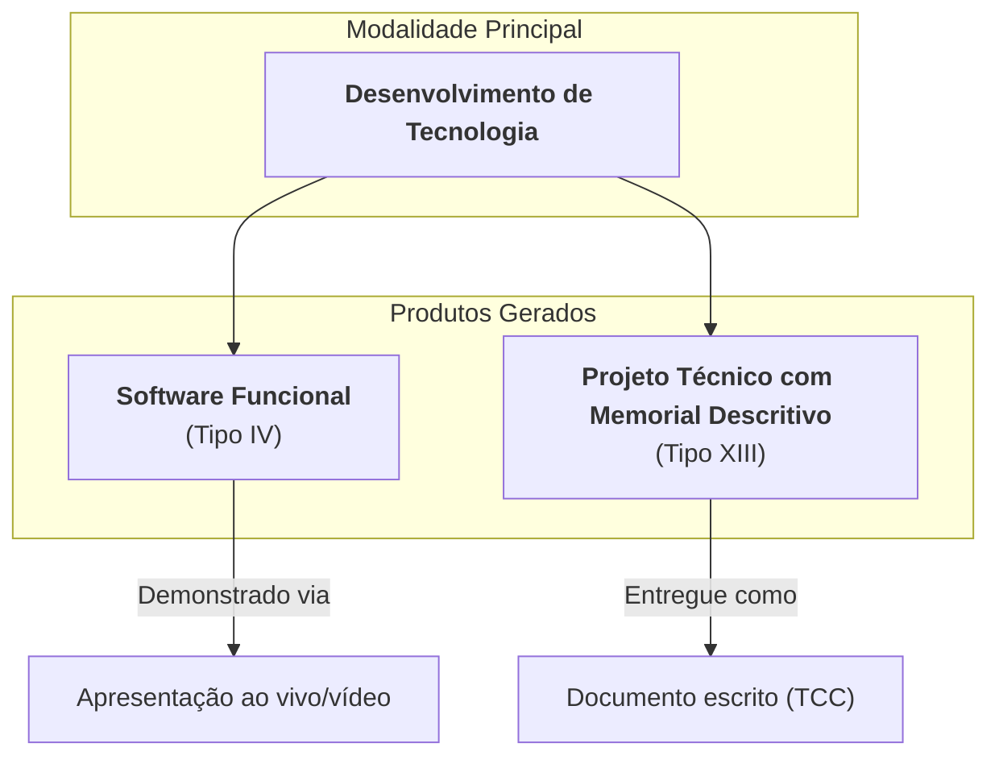

# Estratégia de Apresentação do TCC: Tasksmith

Este documento define a estratégia e o enquadramento mais adequados para a apresentação do projeto Tasksmith como Trabalho de Conclusão de Curso (TCC), com base na análise do manual de TCC fornecido e na natureza do projeto, conforme documentado no `Memory Bank` e nos demais artefatos do projeto.

## 1. Modalidade de TCC Mais Adequada

A escolha da modalidade correta é fundamental para valorizar o trabalho desenvolvido. Com base nas opções disponíveis, as seguintes se destacam como as mais alinhadas ao Tasksmith:

### 1.1. Opção Principal: Desenvolvimento de Tecnologia, Produtos e Serviços

* **Descrição:** Focada na criação ou inovação de um produto tangível, como um software, protótipo ou serviço.
* **Justificativa:** Esta é a modalidade que melhor descreve a essência do Tasksmith. O projeto consiste no desenvolvimento completo de um produto de software funcional, desde a concepção e arquitetura ([`docs/Decisões.md`](docs/Decisões.md:1)) até a implementação de suas funcionalidades ([`docs/Recursos.md`](docs/Recursos.md:1)). Ela abrange perfeitamente a inovação proposta: aplicar gamificação para resolver um problema de produtividade.

### 1.2. Opção Complementar: Protótipo com Manual Técnico

* **Descrição:** Apresentação de um modelo funcional (protótipo) acompanhado de um manual que detalha seu funcionamento e especificações técnicas.
* **Justificativa:** Esta modalidade oferece uma forma prática e concreta de apresentar o projeto em seu estado atual. O Tasksmith, como MVP ([`docs/Escopo.md`](docs/Escopo.md:1)), é um protótipo funcional. O "Manual Técnico" exigido é, na prática, a consolidação de toda a documentação técnica já produzida, como `systemPatterns.md`, `techContext.md` e os documentos no diretório `docs/`.

## 2. Tipos de Apresentação (Produtos Gerados)

Dentro da modalidade escolhida, o TCC se materializará nos seguintes produtos:

### 2.1. Produto Principal: Software, Aplicativos e EULA (Tipo IV)

* **Descrição:** O próprio aplicativo Tasksmith funcional.
* **Justificativa:** Este é o coração do TCC, a demonstração prática de todo o conhecimento aplicado. A apresentação deve focar em uma demonstração ao vivo ou gravada do software em operação.

### 2.2. Produto Complementar: Projeto Técnico com Memorial Descritivo (Tipo XIII)

* **Descrição:** Um documento detalhado que descreve toda a arquitetura, tecnologias, decisões, desafios ([`docs/Desafios.md`](docs/Desafios.md:1)) e soluções do projeto.
* **Justificativa:** Este documento é o que confere o rigor acadêmico e técnico ao trabalho. Ele serve como a "parte escrita" do TCC, validando as escolhas e demonstrando o domínio sobre os conceitos de engenharia de software. Ele será construído a partir dos documentos já existentes.

## 3. Estratégia de Apresentação Combinada

A estratégia mais robusta e de maior impacto é combinar os elementos acima da seguinte forma:

Essa abordagem integrada garante que o TCC seja avaliado tanto por sua execução prática (o software) quanto por sua fundamentação teórica e técnica (o memorial descritivo), atendendo plenamente às exigências acadêmicas e destacando a qualidade do projeto.
