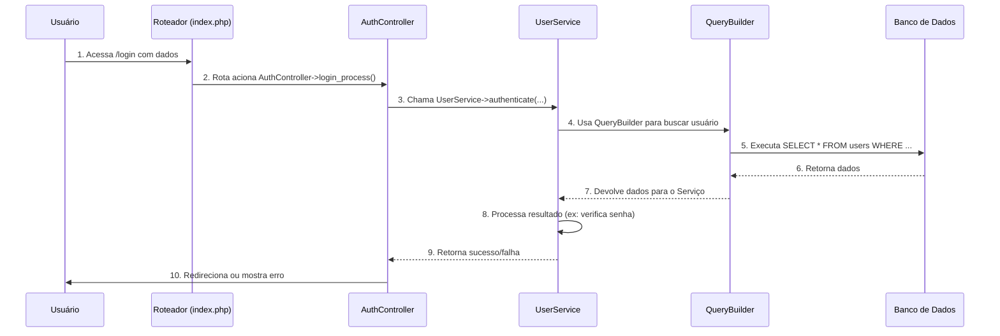

# Base de Conhecimento Técnico - Tasksmith

Este documento serve como um registro consolidado das discussões técnicas, decisões e aprendizados adquiridos durante o desenvolvimento do projeto Tasksmith. O objetivo é criar uma base de conhecimento para consulta rápida sobre os padrões de arquitetura e segurança adotados.

## 1. Arquitetura MVC: O Papel dos Models, Services e Controllers

A arquitetura do Tasksmith foi **projetada** para seguir o padrão Model-View-Controller (MVC), com uma camada de Serviço adicional para encapsular a lógica de negócio. **Esta seção descreve a arquitetura alvo que está em processo de implementação.**

### 1.1. Fluxo de uma Requisição

O fluxo de uma requisição típica, como um login, **foi planejado** para demonstrar a interação entre as camadas, conforme o diagrama abaixo. **Atualmente, a camada de Serviço (`UserService`) ainda não contém a lógica de negócio.**

### 1.2. Diferenciando `Model` e `Service`

A regra de ouro para separar as responsabilidades:

* **`Model`**: Representa uma **entidade** da aplicação (ex: `User`, `Task`). Seu principal papel é ser uma estrutura para carregar e transportar dados. No estado atual, os `Models` não contêm lógica de persistência.
  * **Exemplos**: `src/Models/User.php`, `src/Models/Task.php`.

* **`Service`**: É o especialista em **processos e regras de negócio**. Lida com o **O QUÊ** precisa ser feito, orquestrando múltiplos passos, validações ou `Models`.
  * **Exemplos**: `authenticate($email, $password)`, `registerUser(array $data)`, `completeTask(Task $task)`.

---

## 2. Segurança: Hashing de Senhas e JWT

### 2.1. Hashing de Senhas

* **Conceito**: É um processo de **mão única** para transformar uma senha em um hash seguro. Nunca se armazena a senha original.
* **Como Fazer em PHP**:
  * **Para criar o hash (no registro)**: `password_hash($senha, PASSWORD_DEFAULT);`
  * **Para verificar a senha (no login)**: `password_verify($senhaDigitada, $hashDoBanco);`
* **No Banco de Dados**: A coluna da senha (`password`) deve ser do tipo **`VARCHAR(255)`** para armazenar o hash completo e ser à prova de futuros algoritmos.

### 2.2. Gerenciamento de Sessão: PHP Sessions Nativas

* **Mudança de Decisão**: Inicialmente, o uso de JWT (JSON Web Token) foi considerado para o gerenciamento de sessões. No entanto, a decisão foi reavaliada em favor de uma abordagem mais simples e integrada.
* **Solução Adotada**: Para o escopo atual do projeto, que segue uma arquitetura monolítica com renderização no lado do servidor, o **sistema de sessões nativo do PHP (`$_SESSION`)** é a abordagem mais direta, segura e eficiente. Ele se integra perfeitamente ao ecossistema PHP, eliminando a necessidade de bibliotecas externas para o gerenciamento de tokens.
* **Status de Implementação**: O Tasksmith utilizará as sessões nativas do PHP para gerenciar a autenticação do usuário após o login.

---

### 3. O Papel do `QueryBuilder`

O [`src/Db/QueryBuilder.php`](src/Db/QueryBuilder.php) é a única classe responsável por construir e executar queries SQL.

* **Responsabilidade Única**: Lida exclusivamente com a interação com o banco de dados (CRUD), utilizando `PDO` e *prepared statements* para garantir a segurança contra SQL Injection.
* **Baixo Nível**: Oferece métodos como `db_select()`, `db_insert()`, etc., que são a base para qualquer operação de dados na aplicação.
* **Injeção de Dependência**: A classe recebe a conexão `PDO` em seu construtor, o que a torna desacoplada e testável.

### 3.1. Fluxo de Dados Implementado

O fluxo de dados real (uma vez que os `Services` sejam implementados) seguirá estes passos:

1. O `Controller` recebe uma requisição e chama um método no `Service` apropriado (ex: `UserService->registerUser(...)`).
2. O `Service` executa a lógica de negócio (validações, cálculos, etc.).
3. Para persistir ou buscar dados, o `Service` instancia e utiliza o `QueryBuilder`.
4. O `QueryBuilder` executa a query no banco de dados.
5. Os dados retornados são usados pelo `Service`, que pode então criar e popular um objeto de `Model` (ex: `new User(...)`) para transportar os dados de volta para o `Controller` ou outras camadas.

Essa abordagem mantém os `Models` "limpos" (atuando como DTOs), os `Services` focados na lógica de negócio e o `QueryBuilder` como o único especialista em banco de dados, resultando em um código **seguro, organizado e de fácil manutenção.**
