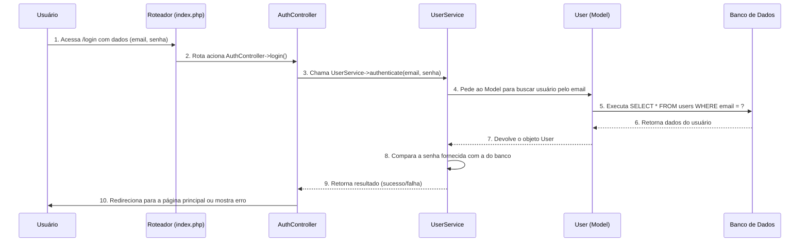

# Base de Conhecimento Técnico - Tasksmith

Este documento serve como um registro consolidado das discussões técnicas, decisões e aprendizados adquiridos durante o desenvolvimento do projeto Tasksmith. O objetivo é criar uma base de conhecimento para consulta rápida sobre os padrões de arquitetura e segurança adotados.

## 1. Arquitetura MVC: O Papel dos Models, Services e Controllers

A arquitetura do Tasksmith segue o padrão Model-View-Controller (MVC), com uma camada de Serviço adicional para encapsular a lógica de negócio, mantendo o código organizado e escalável.

### 1.1. Fluxo de uma Requisição

O fluxo de uma requisição típica, como um login, demonstra a interação entre as camadas:

### 1.2. Diferenciando `Model` e `Service`

A regra de ouro para separar as responsabilidades:

* **`Model`**: É o especialista em **dados**. Lida com o **COMO** buscar e salvar dados em uma tabela específica (CRUD).
  * **Exemplos**: `find($id)`, `findByEmail($email)`, `save(User $user)`.

* **`Service`**: É o especialista em **processos e regras de negócio**. Lida com o **O QUÊ** precisa ser feito, orquestrando múltiplos passos, validações ou `Models`.
  * **Exemplos**: `authenticate($email, $password)`, `registerUser(array $data)`, `completeTask(Task $task)`.

---

## 2. Segurança: Hashing de Senhas e JWT

### 2.1. Hashing de Senhas

* **Conceito**: É um processo de **mão única** para transformar uma senha em um hash seguro. Nunca se armazena a senha original.
* **Como Fazer em PHP**:
  * **Para criar o hash (no registro)**: `password_hash($senha, PASSWORD_DEFAULT);`
  * **Para verificar a senha (no login)**: `password_verify($senhaDigitada, $hashDoBanco);`
* **No Banco de Dados**: A coluna da senha (`password`) deve ser do tipo **`VARCHAR(255)`** para armazenar o hash completo e ser à prova de futuros algoritmos.

### 2.2. JWT (JSON Web Token)

* **Conceito**: É um "crachá de acesso" temporário e seguro que o servidor entrega ao cliente após um login bem-sucedido. O cliente o envia de volta em cada requisição para provar que está autenticado.
* **Fluxo**:
    1. Usuário faz login com sucesso.
    2. Servidor gera um token JWT assinado com uma chave secreta.
    3. Servidor envia o JWT para o cliente.
    4. Cliente armazena o JWT e o envia no cabeçalho `Authorization` de todas as requisições futuras.
    5. Servidor verifica a assinatura e a validade do JWT a cada requisição para autorizar o acesso.

---

## 3. Padrões de Acesso a Dados: Active Record

### 3.1. O que é o Padrão Active Record?

É o padrão onde o próprio objeto do modelo (`User.php`) contém os métodos para interagir com o banco de dados (`find()`, `save()`, `delete()`). O objeto é uma representação "viva" de uma linha da tabela.

* **Prós**: Simples, intuitivo e rápido de desenvolver.
* **Contras**: A classe do modelo acumula mais de uma responsabilidade (dados e persistência).
* **Exemplo Famoso**: O ORM Eloquent do framework Laravel.

### 3.2. Active Record e Query Builder: Parceiros Perfeitos

O `Model` (Active Record) e o `QueryBuilder` não são concorrentes, mas sim colaboradores.

* **O `Model` (Active Record)**: É a **API de alto nível**. Define **o que** você quer fazer em termos de negócio (ex: `User::findByEmail()`).
* **O `QueryBuilder`**: É a **ferramenta de baixo nível**. Define **como** a operação será feita no banco de dados, construindo a query SQL de forma segura e prevenindo SQL Injection.

**Fluxo de Colaboração:**

1. O `Service` chama um método de alto nível do `Model` (ex: `User::findByEmail(...)`).
2. O método no `Model` **delega a construção da query** para o `QueryBuilder` (ex: `QueryBuilder::select(...)`).
3. O `QueryBuilder` retorna os dados brutos.
4. O `Model` transforma os dados brutos em um objeto (`new User(...)`) e o retorna.

Essa parceria garante um código **seguro**, **limpo**, **legível** e de **fácil manutenção**.
