# Proposta de Escopo para TCC: Tasksmith - Gamificação e Produtividade

## 1. Resumo do Projeto Tasksmith para TCC

O Tasksmith é uma aplicação web de lista de tarefas gamificada, desenvolvida com PHP puro, JavaScript vanilla e Tailwind CSS, seguindo uma arquitetura monolítica para otimizar o desenvolvimento e a entrega de um Produto Mínimo Viável (MVP). A proposta central do Tasksmith é transformar a gestão de tarefas diárias em uma experiência envolvente, utilizando elementos de RPG medieval para motivar o usuário.

**Relevância para o TCC:**
Este projeto é altamente relevante para um TCC por permitir a exploração prática de conceitos fundamentais de desenvolvimento web (frontend e backend), design de interface (UI/UX), e, crucialmente, a aplicação de princípios de gamificação. A escolha de tecnologias "puras" (PHP, JS vanilla) demonstra a capacidade de construir uma aplicação robusta sem a dependência excessiva de frameworks complexos, o que é valioso para o aprendizado e a compreensão dos fundamentos. O foco na gamificação oferece um campo fértil para discutir como elementos lúdicos podem impactar positivamente a motivação e a produtividade dos usuários, um tema de crescente interesse em diversas áreas.

**Aspectos Técnicos do MVP:**
O MVP do Tasksmith para o TCC incluirá:

* **Página Inicial:** Apresentação do projeto e seus conceitos com seção call-to-action implementada.
* **Sistema de Roteamento:** Implementação de roteador personalizado em PHP puro com URLs amigáveis.
* **Autenticação:** Funcionalidades de Login e Cadastro de Usuários (estrutura preparada).
* **Painel do Usuário:** Navegação para as áreas de "Forja" e "Quadro de Missões".
* **Gestão de Tarefas:** Criação, edição e remoção de tarefas (estrutura preparada).
* **Sistema de XP e Níveis:** Conclusão de tarefas para ganho de experiência e progressão de nível do personagem.

**Estado Atual da Implementação:**

* ✅ **Estrutura Base:** Arquitetura monolítica implementada com organização clara de diretórios (`src`, `public`, `src/Database`).
* ✅ **Configuração de Ambiente:** `composer.json` definido, `phpdotenv` para variáveis de ambiente e `.htaccess` para URLs amigáveis estão funcionais.
* ✅ **Sistema de Roteamento:** `Routes.php` e o Front Controller (`index.php`) mapeiam URLs para os `Controllers` corretamente.
* ✅ **Camada de Visão (Views):** Estrutura de arquivos para as páginas de `home`, `auth` e `game` está criada.
* ✅ **Camada de Persistência:** O ORM RedBeanPHP foi integrado, substituindo o `QueryBuilder.php` e fornecendo uma abstração robusta para operações de CRUD. O script `src/Database/db_script.php` define o schema do banco de dados.
* ✅ **Camada de Controle (Controllers):** Os `Controllers` foram refatorados para interagir diretamente com os modelos Active Record, orquestrando as requisições e a lógica de negócio.
* ✅ **Camada de Serviço (Services):** Os serviços `UserService` e `TaskManagementService` foram removidos. O `GameService` foi preenchido com a lógica de gamificação.

## 2. Proposta de Escopo do TCC

### 2.1. Tema Sugerido

#### **"Tasksmith: Desenvolvimento de uma Aplicação Web Gamificada para Aumento da Produtividade e Motivação"**

Este tema abrange tanto o aspecto técnico do desenvolvimento quanto o foco na gamificação e seus impactos.

### 2.2. Objetivos

**Objetivo Geral:**
Desenvolver uma aplicação web gamificada (Tasksmith) que auxilie na organização de tarefas e metas, investigando como a aplicação de elementos de jogos pode influenciar a motivação e a produtividade dos usuários.

**Objetivos Específicos:**

1. ✅ **Implementar uma arquitetura monolítica bem estruturada** (Estrutura de diretórios, `composer.json`, `.env`).
2. ✅ **Desenvolver um sistema de roteamento personalizado** em PHP puro (Front Controller, `Routes.php`).
3. ✅ **Definir o schema do banco de dados** e integrar o ORM RedBeanPHP para persistência (`db_script.php`, RedBeanPHP).
4. ✅ **Criar a estrutura de Views e Controllers** para as páginas principais (Home, Auth, Game).
5. ✅ **Implementar a lógica de autenticação e autorização** diretamente nos modelos e controladores.
6. ✅ **Implementar a lógica de gestão de tarefas (CRUD)** diretamente nos modelos e controladores.
7. ✅ **Implementar a lógica de gamificação** no `GameService` para o sistema de experiência (XP), níveis e recompensas.
8. ✅ **Analisar a arquitetura monolítica e a escolha de tecnologias** para o desenvolvimento do MVP.
9. ✅ **Discutir os princípios de gamificação aplicados** no Tasksmith e seus potenciais impactos na motivação.
10. ✅ **Documentar o processo de desenvolvimento**, destacando os desafios e soluções.

**Legenda:** ✅ Concluído | 🔄 Em desenvolvimento/Planejado

### 2.3. Estrutura do TCC (Sugestão de Capítulos/Seções)

* **Capítulo 1: Introdução**
  * 1.1. Contextualização e Problema
  * 1.2. Justificativa
  * 1.3. Objetivos (Geral e Específicos)
  * 1.4. Estrutura do Trabalho
* **Capítulo 2: Fundamentação Teórica**
  * 2.1. Gamificação: Conceitos e Aplicações
  * 2.2. Produtividade e Motivação: Teorias Psicológicas
  * 2.3. Desenvolvimento Web com Tecnologias "Puras"
  * 2.4. Arquiteturas Monolíticas vs. Microsserviços
* **Capítulo 3: Metodologia**
  * 3.1. Abordagem de Desenvolvimento (Iterativa e Incremental)
  * 3.2. Tecnologias Utilizadas (PHP, JS Vanilla, Tailwind CSS)
  * 3.3. Ferramentas de Desenvolvimento e Versionamento
* **Capítulo 4: Desenvolvimento do Tasksmith**
  * 4.1. Planejamento e Definição do MVP
  * 4.2. Arquitetura e Design do Sistema
  * 4.3. Implementação das Funcionalidades
    * 4.3.1. Sistema de Autenticação
    * 4.3.2. Gestão de Tarefas (CRUD)
    * 4.3.3. Sistema de XP e Níveis
  * 4.4. Desafios Técnicos e Soluções Adotadas
* **Capítulo 5: Análise e Discussão**
  * 5.1. Avaliação da Arquitetura Monolítica
  * 5.2. Eficácia dos Elementos de Gamificação
  * 5.3. Experiência do Usuário e Interface
  * 5.4. Limitações e Oportunidades de Melhoria
* **Capítulo 6: Considerações Finais**
  * 6.1. Conclusões
  * 6.2. Trabalhos Futuros
  * 6.3. Contribuições do Projeto

### 2.4. Metodologia de Documentação do Processo de Aprendizado

Uma característica distintiva deste TCC será a **documentação detalhada do processo de aprendizado** durante o desenvolvimento. Cada etapa de implementação será acompanhada de:

* **Decisões:** Justificativas para escolhas técnicas e de design.
* **Desafios:** Obstáculos encontrados e como foram identificados.
* **Soluções:** Estratégias adotadas para superar os desafios, incluindo pesquisa e aquisição de novos conhecimentos.
* **Reflexão:** O que foi aprendido em cada etapa e como isso contribui para o conhecimento geral do desenvolvedor.

Esta abordagem permitirá que o TCC não seja apenas a descrição de um produto, mas também um relato da jornada de aprendizado e resolução de problemas.

## 3. Diagrama de Arquitetura (Estado Atual)

```mermaid
graph TD
    A[Usuário] -->|Acessa| B(Navegador Web)
    B -->|Requisição HTTP| C(Servidor Web)
    C -->|.htaccess| E(index.php - Front Controller)
    E -->|Carrega| F(src/Routes.php)
    F -->|Mapeia Rota| G["src/Controllers/*"]
    
    subgraph "Estrutura Implementada ✅"
        G --> H["src/Views/*"]
        G --> I["src/Models/* (Active Record com RedBeanPHP)"]
        I --> J["src/Database/conn.php (Configuração RedBeanPHP)"]
        J --> K["Schema do BD (definido em src/Database/db_script.php)"]
        G --> L["src/Services/GameService.php (Lógica de Gamificação)"]
        
        style H fill:#d3f8d3
        style I fill:#d3f8d3
        style J fill:#d3f8d3
        style K fill:#d3f8d3
        style L fill:#d3f8d3
    end

    I -.-> L
```

